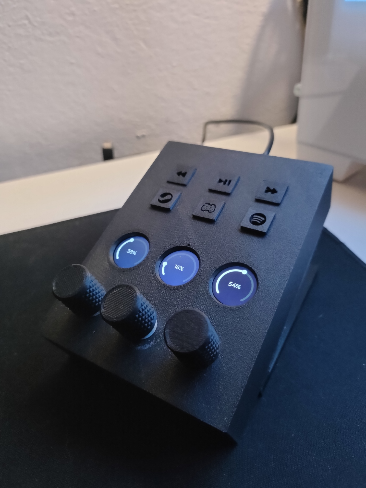

# DIY-Stream-Deck

A compact physical audio mixer to control individual application volumes on a Windows PC using rotary encoders and an ESP32 microcontroller. Supports real-time volume adjustment, mute toggling, and automatic channel reset when applications close.

## Features

- Controls up to 3 independent audio channels  
- Real-time volume control and mute/unmute per channel  
- Automatic reset of channel volume when applications close  
- Application priority mapping  
- Serial communication between Windows PC (Python script) and ESP32    

## Components

- ESP32-S3 DevKitC  
- 3x EC11 rotary encoders with push buttons  
- 3x GC9D01 LCD's display (from aliexpress)

## Included in This Repository

- STL files for 3D printing the case and encoder knobs   
- Electrical connection schematic  
- Python script for Windows PC volume management  
- Arduino `.ino` sketch for ESP32 firmware  

